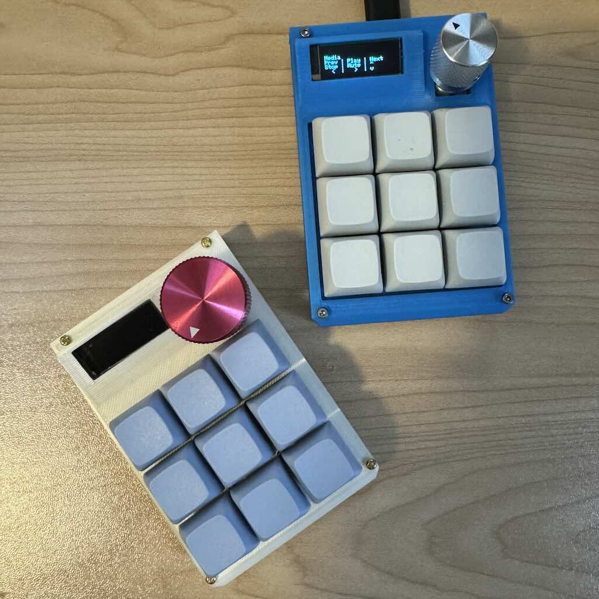

# 3x3 Macropad: PCB, Firmware, STL, Programmer

Self-designed, hacked-together 3x3 macropad.

## Features:

* 4 layers configurable with [via](https://www.caniusevia.com/) and selectable
  by clicking the rotary encoder.
* OLED display to display per-layer text (programmable with tool in
  [`cli/`](cli/README.md)).
* Rotary encoder with volume control and layer select button.
* 256Kb EEPROM (24LC256).

## Project layout:

* [`cli/`](cli/README.md) - Tool to program keyboard (primarily to change OLED
  text) and change the layer text.
* [`via/`](via/README.md) - Via json config (TODO: merge into via) that can be
  used for creating custom keymaps in Via (once merged into via, this should no
  longer be necessary).
* [`firmware/`](firmware/README.md) - [QMK](https://qmk.fm/)-based firmware
  (TODO: merge into QMK) and instructions for flashing the firmware.
* [`hardware/`](hardware/README.md) Gerber file for PCB and STL/3mf for
  enclosure.

## Updating firmware:

In order to flash a new firmware version, the device needs to be reset and
boot into DFU mode for flashing. This can be done in one of two ways:

* Hold down the top left key in the 3x3 grid and plug the keyboard in. The
  keyboard should enter DFU mode for a period of time that will allow you to
  flash new firmware.
* If this does not work, you can use the reset button on top of the PCB. You'll
  need to remove at least the top cover in order to access the button.

See the instructions in [`firmware/`](firmware/) for more details.

## Kit Assembly

Overview and detailed Assembly instructions can be found in the
[`hardware/`](hardware/README.md) directory.
