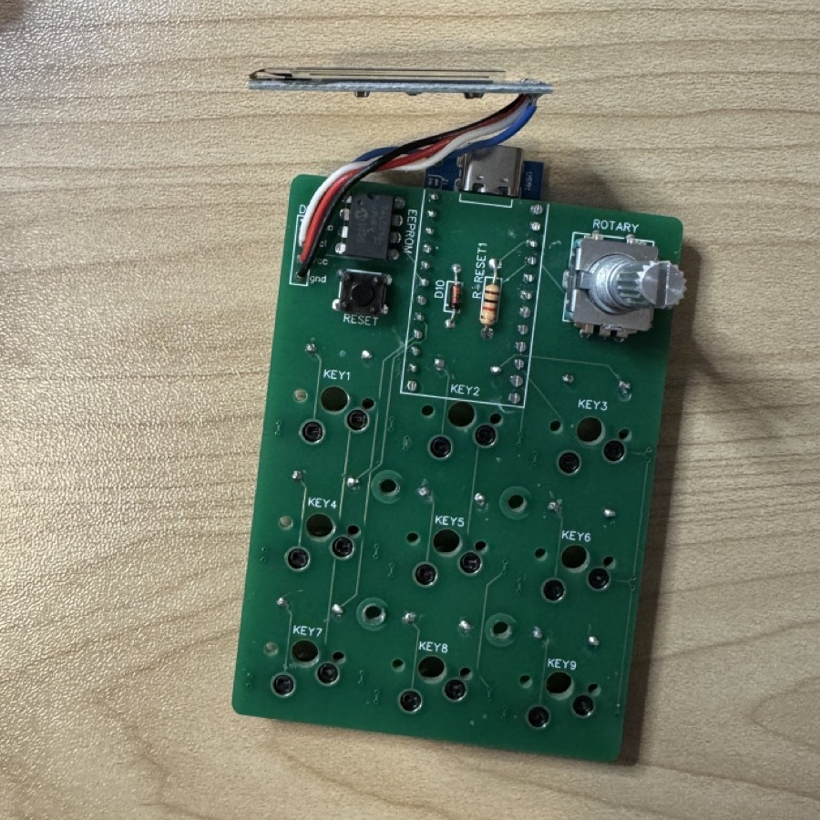
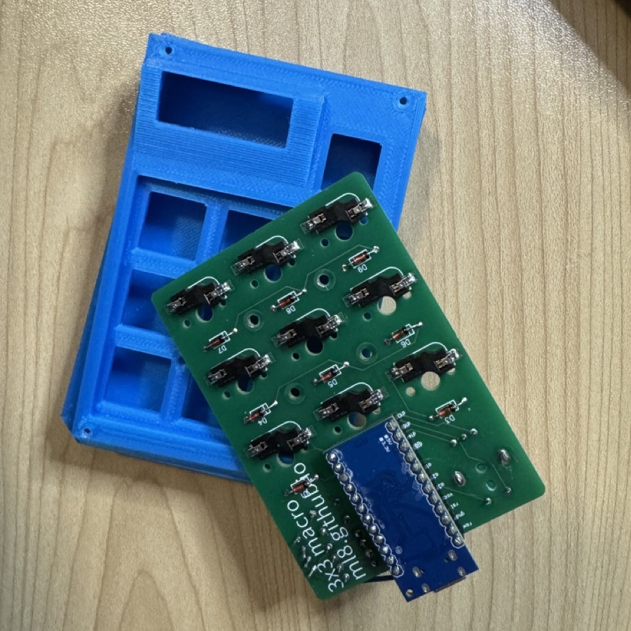
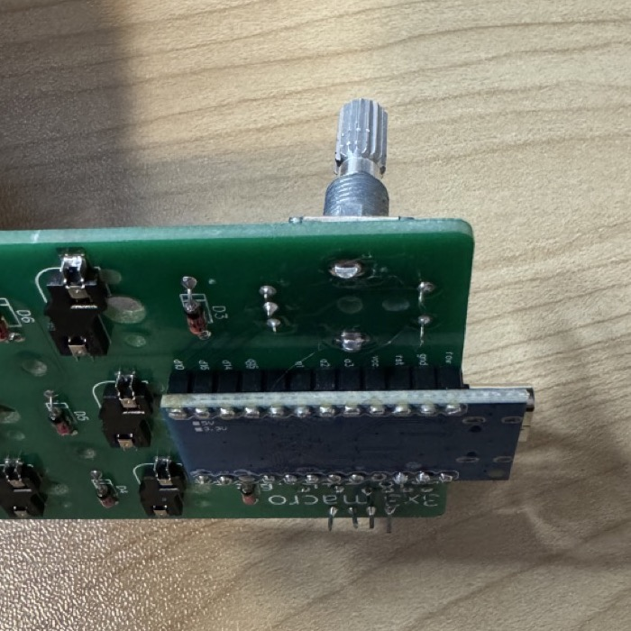

# Hardware

This contains the Gerber for the PCB and STL/3mf files for the enclosure.

## BOM

All components are through-hole except for the hot-swap sockets.

| Component | Quantity | Note |
| --------- | -------- | ---- |
| Arduino Pro Micro | 1 | |
| 0.91" 128x32 OLED | 1 | requires hand-wiring |
| 24LC256 EEPROM | 1 | | 
| 6x6 tactile momentary switch | 1 | 5mm or 4.3mm height |
| EC11 Rotary Encoder (clickable) | 1 | + knob |
| 1N4148 diodes | 10 | |
| MX-style switches | 10 | + keycaps |
| 1k resistor | 1 | |
| MX hotswap sockets | 10 | |
| m2x8 screws | 4 | for enclosure |
| m2x4 screws | 4 | for enclosure |
| m2 5mm standoffs | 4 | for enclosure |
| m2 nuts | 4 | for enclosure |

## Assembly Notes

1. Begin by mounting 3x3 matrix diodes (D1-D9) and hotswap sockets to underside
   of board (where their labels are). Solder these in place.
   * The hotswap sockets are easiest to solder when you put a small amount of
     solder on the pad, then place the socket and heat the pad. 
   * The D10 diode will be soldered on top of the board. 
   * It's easier to solder the hotswap sockets first, so that you don't have to
     worry about the board sitting stably while soldering these.
2. Next, mount the D10 diode, the resistor (R-RESET) to top of board. Solder in
   place.
3. Mount the EEPROM, reset switch, and rotary encoder on top of the board; solder
   them in place.
4. Solder headers facing __upward__ on Pro Micro, then mount to bottom of
   PCB (see completed picture).
5. Use wires to connect sda/scl/vcc/gnd to the corresponding pins on the 128x32
   OLED. The OLED will be mounted to the inside of the enclosure, so make sure
   the wires are long enough to reach, but short enough to fit under the OLED
   once it is mounted.
6. Assemble the bottom of the enclosure, mounting the PCB to the standoffs.
    * Put the nuts in the bottom of the case (you may have to push hard to push
      them in--they should be snug).
    * Screw in the standoffs, then slide the PCB into the bottom of the
      enclosure.
    * Screw 4 m2x4 screws to mount the PCB inm place.
7. Put the switch plate on (do __not__ screw in place) and mount switches in
   hotswap sockets.
8. Program the firmware, if the pro micro is not pre-programmed. Follow the
   instructions in [`firmware/`](../firmware/README.md).
9. Tape or otherwise affix the OLED to the inside of the top of the enclosure,
   then mount the enclosure. Screw it in place with 4 m2x8 screws. Put the
   encoder knob on.

## Assembly Photos

